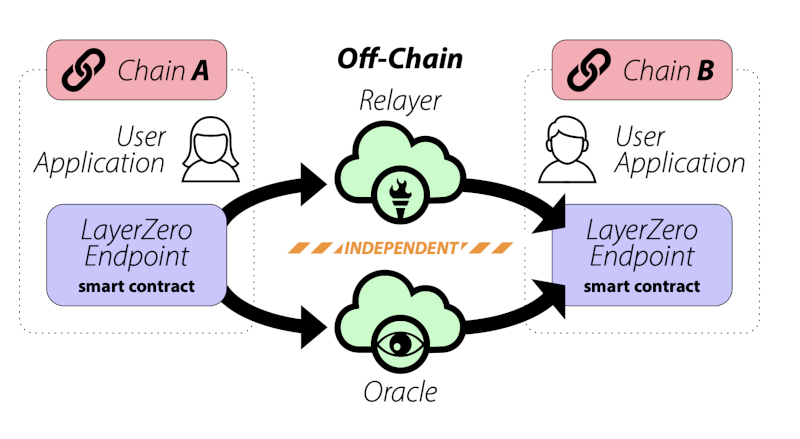

# Bridge Mining for Blockchain Interconnect
A Whitepaper by 0x0proxy.eth. Created 29 July 2022  
DRAFT Version BRDG-ENG-150822

## Overview

Blockchain technology provides strong internal consistency guarantees
for on-chain state.  However, mechanisms for bridging between
blockchains and mechanisms for bringing off-chain information onto a
blockchain (oracles) have historically been less reliable. Indeed, a
preponderance of successful DeFi exploits over the last five years
have exploited flaws in bridging or price oracles. [insert various
references]

In this paper we describe a unified mechanism to provide strong
security guarantees for bridges and for oracles, utilizing a
methodology we call "bridge mining."  Bridge mining creates a
distributed, difficult-to-attack consensus mechanism similar to, but
distinct from proof of work and proof-of-stake, though it is
compatible with both underlying chain consensus mechanisms.

## Problems to Solve

Bridges between blockchains are essential to the operation of many
important and useful blockchain protocols. However, the problem of
securely bridging between blockchains remains an open problem, as
evidenced by the large number and high value of recent bridge attack
exploits. Since mature blockchain L1s are rarely the subject of
successful chain-level attacks, why do bridges remain so vulnerable?

This is because while blockchain protocols provide relatively strong
security and consistency guarantees, connections between blockchains
necessarily exist outside such guarantees, and present low-redundancy
failure modes, in some cases requiring only the compromise of a single
signer.

Similarly, oracles are essential to the operation of many DeFi
protocols since price signals often originate off-chain, e.g. the
exchange rate of BTC/USD, as reported by Coinbase. While the
centralized nature of some price signals is not directly addressable,
centralized points of failure relating to observing such signals is. 

Protocols such as Chainlink offer solutions to some oracle problems,
but price oracle attacks remain distressingly common.  For example, in
May of 2022 the Fortress protocol 
[lost all of its funds](https://cryptonews.com/news/defi-lending-protocol-fortress-loses-all-funds-oracle-price-manipulation-attack.htm)
in a price manipulation attack.

In this paper we outline a technical solution for better bridging and
better price oracles, all within a single unified distributed
consensus framework.  The security of this solution increases as the
number of participating nodes increases, making it similar to the
consistency guarantees offered by a conventional L1. And while we
describe bridging and oracles as separate problems, at a deeper level
they are very similar, and the solution for both hinges on the same
core idea of entropy generation and stochastic node self-selection for
verification and validation.

## The Bridging Problem

### What is a bridge?

A bridge is a mechanism by which a state change on one blockchain can
be reflected onto another. For example, the Bitcoin network has a
number of desirable properties in terms of security, decentralization,
and scale. However, the Bitcoin network has technical limitations that
make implementing certain types of DApps difficult. Ethereum, by
contrast, more gracefully supports a wider range of smart contracts,
though ETH has historically not been considered as robust a store of
value as BTC. If it were possible to "move" BTC onto Ethereum, one
could in principle have the best of both worlds. How would this be
possible?

With a small amount of thought, an answer presents itself. Some
quantity of BTC is transferred to a Bitcoin wallet address that is
controlled by an escrow mechanism, locking this BTC. At the same time,
a proxy asset such as "[wrapped Bitcoin](https://wbtc.network/)" is
issued on the Ethereum network as an ERC20 token. Since the proxy
asset corresponds 1:1 to the original asset, and can be converted back
to the original through a burning/unlocking process, a strong argument
can be made for the value of the proxy asset being the same as the
original.

### Why do bridges present security risks?

Because a bridge represents a link between two separate chains, the
bridge can never be more secure than the consensus mechanism of either
chain. For that reason, bridges will always be vulnerable to successful
51% attacks on the underlying bridged chains, as [Vitalik Buterin
points
out](https://old.reddit.com/r/ethereum/comments/rwojtk/ama_we_are_the_efs_research_team_pt_7_07_january/hrngyk8/).

Furthermore, Vitalik points out that bridges can create systemic risk:
as bridges proliferate willy-nilly, the security of the bridged
ecosystem because as weak as the weakest link. However, bridging is an
essential feature of many protocols, and bridges are unlikely to
disappear any time soon.  Thus, we believe the goal should be strong,
secure bridging, with security guarantees that approach the robustness
of the underlying L1s.

Unfortunately, bridges are often much less secure than the consensus
layers of the blockchains. As one recent example as of the time of
this writing, the [Nomad Bridge was drained of about 200M USD](https://www.theverge.com/2022/8/2/23288785/nomad-bridge-200-million-chaotic-hack-smart-contract-cryptocurrency) due to a very basic smart contract bug.

However robust and secure the original Bitcoin network might be, and
however robust and secure the Ethereum network might be, the fact
remains that the bridge depends upon an escrow mechanism exists
outside both blockchains, and presents what is effectively a single
point of failure. Worse, the amount of value at risk isn't limited to
the value of the asset locked in escrow, since a successful attack
could result in arbitrarily large amounts of proxy asset being issued
and converted to other forms of value before the exploit might be
discovered. 

## How can we implement bridges with security guarantees?

Given that bridges are essential to the operation of a wide range of
DeFi protocols and are unlikely to go away any time soon, how can we
implement bridging in a secure way? Let's consider a set of bridge
implementations that build on each other in terms of security
guarantees.

### Naive Implementation

The naive implementation of a bridge is a deterministic algorithm that
observes the state of both blockchains and operates with sufficient
credentials to unilaterally perform all necessary bridging
operations. This algorithm must have signing authority over both the
escrow contract on the "sending" side of the bridge and the
minting/burning contract on the receiving side of the bridge. Thus,
this algorithm must constantly have access to private keys that, if
compromised, could lead to arbitrary bridge exploits.

Since this is the naive implementation, not a broken implementation,
we assume that this algorithm is implemented correctly and, for a
given set of inputs, will always perform the correct state change
operations. So what could possibly go wrong? Lots.

Any real embodiment of this bridge requires a network-connected server
or container performing RPC calls to two separate blockchains, perhaps
a Node.js script running in an Alpine Linux docker container in AWS or
Google Cloud. The physical and network security of this container is
only as good as the security of the underlying hardware, data center,
container orchestration system, operating system kernel, and the
hundreds of Node.js packages upon which it depends. Even if the bridge
code itself were provably correct, the likelihood that the underlying
tech stack presents numerous zero-day vulnerabilities approaches
certainty. And what about exploits relating to hardware access?

But it isn't simply exploits we have to worry about. Presumably
somebody has control over this container, and some other persons have
control over the server and data center. Whoever is involved might be
subject to extortion or millions of dollars in bribes. Or maybe they
just want to drain the bridge themselves — you won't find out till
it's all converted to Monero and they are on the plane to Bermuda.

By placing this bridge and all relevant personnel at the center of an
intensive, paranoid, defense-in-depth security system, we might have
some security assurances, but at what cost, and for how long?

### Upgrading the Naive Implementation: Layer Zero
We are not the first ones to take the prospect of secure bridging
seriously. For example, the [Layer Zero
Protocol](https://layerzero.network/pdf/LayerZero_Whitepaper_Release.pdf) provides
a communication mechanism between blockchains in which two separate off
chain entities, a relayer and an oracle, must agree in order for a
transaction to proceed.

Layer Zero is a step up over a naive bridging implementation and may
be suitable for a range of medium-security applications.  However, the
requirement that two independent entities validate a transaction may
not be strong enough, especially if an attacker can predict which
entities might be involved and perform a credential theft attack or
otherwise subvert the security of both entities.

### Adding Human Oversight and Redundancy

If a naive algorithmic bridge, or a dual-redundant bridge such as
offered by Layer Zero, presents a high risk of exploit, the next
logical step might be to add human oversight and additional
redundancy. In this approach we create an escrow mechanism and
minting/burning contract that require multiple, independent human
approvals before new assets are issued or redeemed. These approvals
require signing with separate credentials, which are stored separately
and kept offline except for signing operations. Conceptually, this
could be implemented as a bridge committee DAO, perhaps meeting once
per day, in which the signatures of a quorum of human signers would
have to approve the requested bridging operations of the previous 24
hours.

Obviously, such a solution would introduce tremendous latency but
would make credential stealing attacks more difficult. And if
implemented correctly, successful exploitation would require
credential theft from or the bribery/extortion of multiple members of
the approval group, representing a significantly higher bar.

Unfortunately, experience shows that having a committee in charge of a
bridge or protocol doesn't defend against one of the most likely
threat scenarios, in which a quorum of the committee colludes to steal
the assets. Thus, this is simply yet another massive rug-pull waiting
to happen. And as the value of the bridged assets grows, so will grow
the temptation. And in the long run, a group of patient attackers
could infiltrate the bridge committee DAO, perhaps waiting years for
their chance.

While added redundancy and human oversight might help mitigate some
risks, the effective concentration of decision making still presents
significant long-term risks, especially as the value of the target
grows.

So maybe adding human oversight doesn't solve much of the security
problem. But what if we added more redundancy? Lots more?

## Proposed Solution: Bridge Mining

We propose a solution to the bridging problem that has the security
properties of an L1, namely that a successful exploit would require
the compromise of multiple, independent, and heterogeneous nodes, and
in which the security of the bridging system grows proportionally with
the number of nodes that are added. Our proposed solution also
imposes a topological structure on the bridging system that minimizes
complexity and risk.

### Bridging Topology: Hub-and-spoke vs n^2
Right now, bridges (such as those provided by Layer Zero) are
generally an ad-hoc affair. If a bridge is necessary between chain
**A** and chain **B**, that specific **A-B** bridge is created.  But
what if we then need a bridge between chains **B** and **C**? Fine, we
create that **B-C** bridge, too. But now what happens if we then
create a **C-A** bridge? Potentially, messages can now run around in a
circle, from **A** to **B** to **C** and back to **A** again,
multiplying assets as they go. This is the danger of creating
cyclic structures in bridging.

Arbitrary bridging, even when cycles are not introduced, quickly leads
to an **n**^2 explosion in the number of bridges, a nightmare for
security and management. A much better topology would be a
hub-and-spoke model, where assets on spoke blockchains must bridge
onto and off of a hub blockchain.  Not only is this topology order
**n** in the number of bridges, the hub can enforce acyclic bridging
relationships. Furthermore, that hub blockchain could be used for many
other cross-chain and multi-chain applications.

**Insert hub-and-spoke vs n^2 diagram here**

### A blockchain for bridging... and for other things, too 😉
We believe that the proper structure for bridging is a hub-and-spoke
topology, limiting the number of bridges and enforcing an acyclic
topology. This implies that one blockchain act as the hub, and we
propose creating a blockchain specifically for this role, though the
hub chain will be ideally situated to provide a range of useful
cross-chain and multi-chain applications beyond bridging.

This bridging blockchain will be structured so that each bridging
node will include oracles/relayers for all bridged chains, and can be
called upon to act as an independent verifier for bridging. Bridging
nodes will be chosen in an unpredictable fashion to verify and
finalize bridging operations, with three or more independent
verifications required before finalization.  Since an attacker will
not be able to predict which nodes will be involved in verifying or
finalizing transactions, the security of this bridging system will
scale with the size of the network.

#### Bridge Chain Node Architecture

We envision a new L1 (almost certainly based on the time-tested
EVM/Geth stack, though a Jupiter/Cosmos implementation or some other
bespoke implementation is conceivable as well) in which each node in
the chain is actually a tightly integrated cluster of nodes: One
"full" bridge-mining node and one or more lightweight or full nodes
for each supported asset bridging chain. An example cluster is shown
below:

**insert diagram of Zero Chain (bridge mining) node with Bitcoin,
Ethereum, Solana, and Binance Smart Chain nodes**

This node cluster is deployed as a single container or tightly
orchestrated set of containers with the **Bridge Control Script**
(likely a Node.js or Python script) receiving events from each node
and interacting with appropriate smart contracts on all nodes.

The Bridge Control Script will receive an event each time a new block
is issued on the bridge mining L1. At that point, the script will
determine whether it is participating in validation, as described
below.

#### Distributed, unpredictable bridge transaction validation

**NOTE: Edits in progress**

Just as miners compete to add the next block to a conventional
proof-of-work blockchain, in bridge mining each mining node would
cooperate to validate bridging transactions. The algorithm is as
follows:

For each new block on the blockchain:

* Each bridge mining node will "roll the dice" (see pseudocode below)
  to determine if it is self-nominating to participate in bridge
  validation. The result of the roll can be one of three states: no
  action, transaction verification, or transaction finalization.
* In the `no action` state, the node does not participate in
  validation for this block. For blockchains with more than a small
  number of bridge mining nodes, this is the most likely outcome.
* In the `transaction verification` state, the node reviews all
  unexpired, unfinalized bridging requests older than the
  `confirmation threshold`, say five blocks. (requests younger than
  the threshold are considered to be provisional, and may be subject
  to a block reorganization). A `bridging request` is a smart-contract
  transaction requesting to bridge an asset on to, or off of, the
  bridging chain. Each bridging request can be identified by a unique
  transaction hash.

  For each new or unfinalized bridging request older than the `confirmation threshold`\:
  * If the request is older than the `expiration threshold`, say ten
    blocks, the request is expired and will be ignored. Assets that
    have been temporarily locked in escrow will be unlocked and
    available for withdrawal.
  * If the request is not expired and appears to be properly
    constructed and authorized based on on-chain state, the node marks
    the request as provisionally confirmed and posts a `confirmation
    message` on the corresponding chain. Several such provisional
    confirmations and `confirmation message` may have already been
    posted, or will be posted by other nodes this block or in future
    blocks.
  * If a request is not expired but does not appear to be properly
    constructed/authorized, no action is taken, though a log event may
    be generated
* In the `transaction finalization` state, the node reviews all
  unexpired, confirmed bridging transactions. For each confirmation
  that appears valid, it increments a counter associated with the
  underlying bridging request. If the counter exceeds a `verification
  threshold`, the node invokes the underlying smart-contract method
  for the bridging operation, citing the hashes of the valid
  confirmations.
* increment a confirmation counter for the confirmed transaction's
  bridging request

## The Oracle Problem

### Similarities to the Bridging Problem

### Adapting self-nomination to Distributed Oracles

## Combining Oracles and Bridging

## Conclusions

